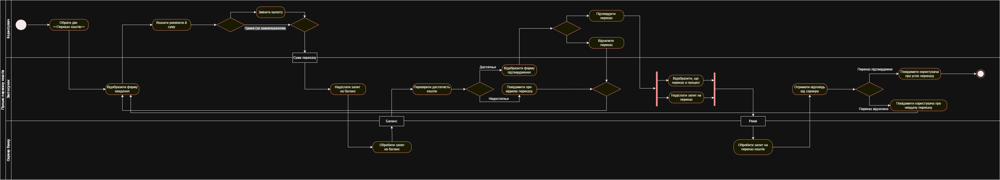
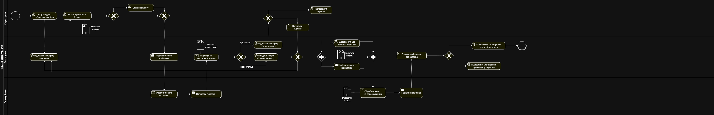

# 📄 README – Activity Diagram & BPMN Diagram

## Activity Diagram
Діаграма активностей моделює послідовність дій у процесі та логіку переходів між ними.  
Вона показує потоки управління, розгалуження, паралельність та участь різних виконавців.

**Діаграма активності процесу транзакції між банками:**  

---

## BPMN Diagram
BPMN (Business Process Model and Notation) використовується для моделювання бізнес-процесів на більш високому рівні.  
Діаграма відображає взаємодію учасників, події, завдання, шлюзи та потоки повідомлень.

**BPMN діаграма процесу транзакції між банками:**  

---
